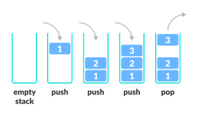

# Stack

* Last in first out (LIFO)
* operations

  * push: Add an element to the top of a stack
  * pop: Remove an element from the top of a stack
  * isFull: Check if the stack is empty
  * isEmpty: Check if the stack is full
  * peek: Get the value of the top element without removing it
* complexity of push and pop operations take constant time, i.e. O(1)
* Applications

  * **To reverse a word** - Put all the letters in a stack and pop them out. Because of the LIFO order of stack, you will get the letters in reverse order.
  * **In compilers** - Compilers use the stack to calculate the value of expressions like `2 + 4 / 5 * (7 - 9)` by converting the expression to prefix or postfix form.
  * **In browsers** - The back button in a browser saves all the URLs you have visited previously in a stack. Each time you visit a new page, it is added on top of the stack. When you press the back button, the current URL is removed from the stack, and the previous URL is accessed.
