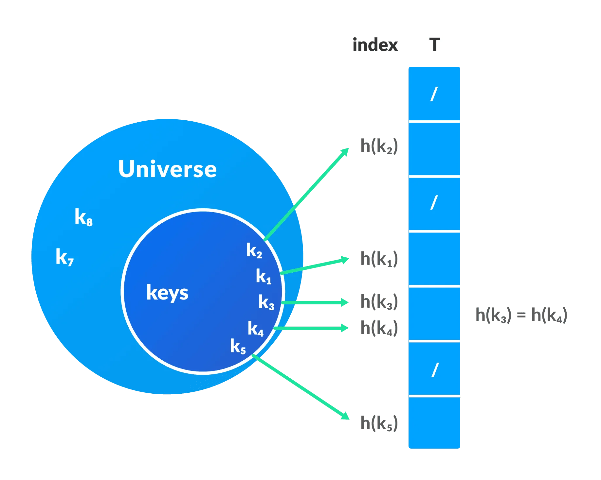

# Hash Table

* The Hash table data structure stores elements in key-value pairs where

  * **Key**- unique integer that is used for indexing the values
  * **Value** - data that are associated with keys.
* When the hash function generates the same index for multiple keys, there will be a conflict (what value to be stored in that index). This is called a **hash collision.**

  * Collision resolution by chaining

    * In chaining, if a hash function produces the same index for multiple elements, these elements are stored in the same index by using a doubly-linked list.
    * > chainedHashSearch(T, k)
      > return T[h(k)]
      > chainedHashInsert(T, x)
      > T[h(x.key)] = x //insert at the head
      > chainedHashDelete(T, x)
      > T[h(x.key)] = NIL
      >
  * Open Addressing: Linear/Quadratic Probing and Double Hashing

    * Unlike chaining, open addressing doesn't store multiple elements into the same slot. Here, each slot is either filled with a single key or left `NIL`.

      * Linear Probing

        * `h(k, i) = (h′(k) + i) mod m`
        * `i = {0, 1, ….}`
        * `h'(k)` is a new hash function
      * Quadratic Probing

        * `h(k, i) = (h(k) + c1i + c2i2) mod m`
        * `c1`and`c2` are positive auxiliary constants,
        * `i = {0, 1, ….}`
      * Double hashing

        * `h(k, i) = (h1(k) + ih2(k)) mod m`
* Good Hash Functions

  * A good hash function may not prevent the collisions completely however it can reduce the number of collisions.
  * Division Method

    * If `k` is a key and `m` is the size of the hash table, the hash function `h()` is calculated as:

    `h(k) = k mod m`
  * Multiplication Method

    * `h(k) = ⌊m(kA mod 1)⌋`
    * `kA mod 1` gives the fractional part `kA`
    * `⌊ ⌋` gives the floor value
    * `A` is any constant. The value of `A` lies between 0 and 1. But, an optimal choice will be `≈ (√5-1)/2` suggested by Knuth
  * Universal Hashing

    * In Universal hashing, the hash function is chosen at random independent of keys.
* applications

  * constant time lookup and insertion is required
  * cryptographic applications
  * indexing data is required
